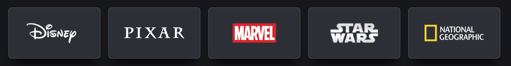

# 🎬 Disney+ Cards UI

Uma interface inspirada nos cards de categorias do Disney+, desenvolvida para fins de estudo em HTML, CSS.

---

## ✨ Preview

Ao passar o mouse sobre os cards:
- A borda ganha destaque
- O card aumenta suavemente
- Um vídeo animado aparece no fundo assim como no site

Inspirado nos cards oficiais do Disney+.

  

---

## 🚀 Tecnologias Utilizadas

- HTML
- CSS

---
👨‍💻 Autor

Feito por Johann Jarmelo
